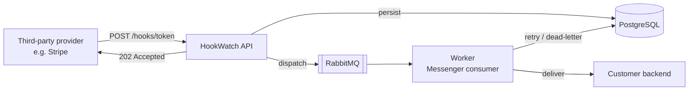
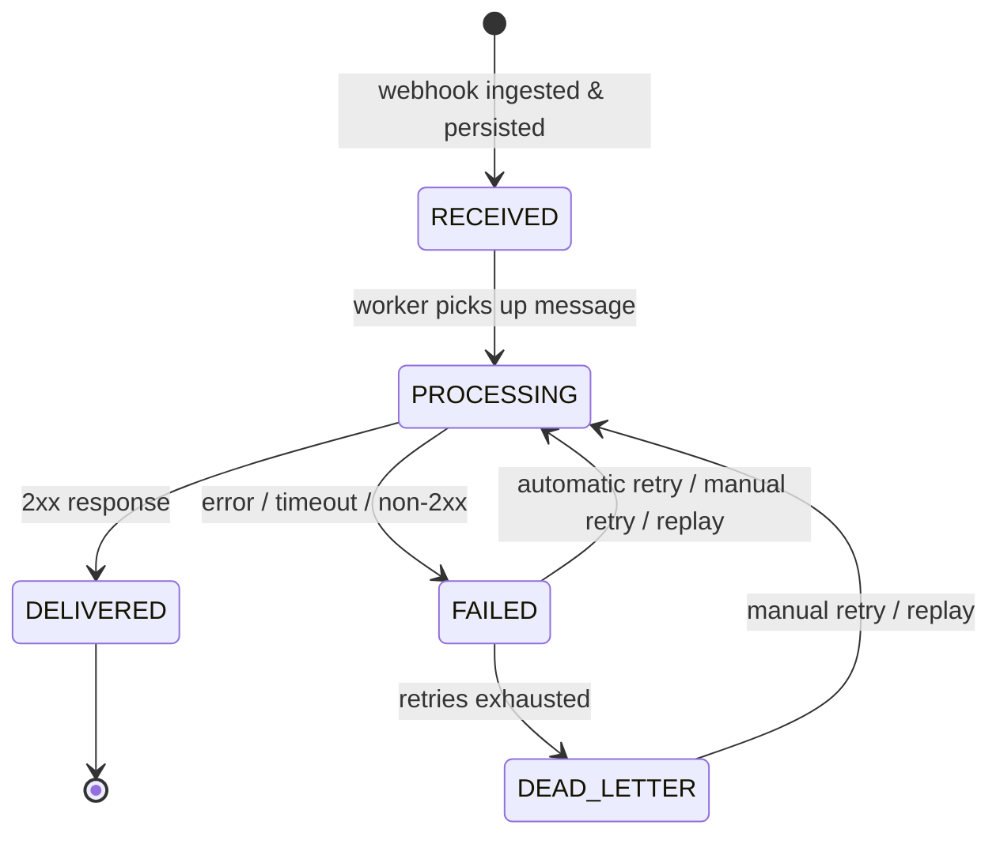

# HookWatch

[](https://github.com/francessergi/hook-watch/actions/workflows/ci.yml)


HookWatch is a webhook reliability and observability service that sits between third-party webhook providers and customer backends.



It receives webhooks, persists them before acknowledging receipt, delivers them asynchronously, retries transient failures, and provides inspection, retry, and replay capabilities.

## Event lifecycle



## MVP stack

- Symfony
- PostgreSQL
- RabbitMQ
- Symfony Messenger
- Docker / Docker Compose
- PHPUnit
- PHPStan
- GitHub Actions

## Core capabilities

- Webhook endpoint management
- Durable webhook ingestion
- Asynchronous delivery
- Delivery attempt history
- Automatic retries with backoff
- Dead-letter state
- Manual retry
- Replay
- Deduplication when a provider supplies an external event ID

See [TODO.md](TODO.md) for what's still planned (dashboard UI, PHPStan, public deployment, etc.).

## Contributing

Want to help out? Check [TODO.md](TODO.md) for the current status and a list
of open tasks/good first contributions.

## Documentation

- [Product](docs/01-product.md)
- [Architecture](docs/02-architecture.md)
- [Domain Model](docs/03-domain-model.md)
- [API](docs/04-api.md)
- [MVP Scope](docs/05-mvp-scope.md)
- [Development Plan](docs/06-development-plan.md)
- [Architecture Decisions](docs/07-decisions.md)
- [Local Development & Manual Testing Guide](docs/08-local-dev-guide.md)

## Status

MVP foundation is implemented in the `api/` Symfony application with Doctrine entities, webhook ingestion, delivery flow, API endpoints, tests, and Docker configuration.

## Run locally

See [docs/08-local-dev-guide.md](docs/08-local-dev-guide.md) for the full guide,
including manual testing with curl/Bruno and RabbitMQ/AMQP setup notes.

Quick start with Docker Compose (recommended):

```bash
docker compose up --build
docker compose exec api php bin/console doctrine:database:create --if-not-exists
docker compose exec api php bin/console doctrine:migrations:migrate -n
```

Or run the app directly on the host against dockerized PostgreSQL/RabbitMQ:

```bash
docker compose up -d postgres rabbitmq
cd api
composer install
php bin/console doctrine:database:create --if-not-exists
php bin/console doctrine:migrations:migrate -n
php -S 127.0.0.1:8000 -t public
# in another terminal:
php bin/console messenger:consume async -vv
```
